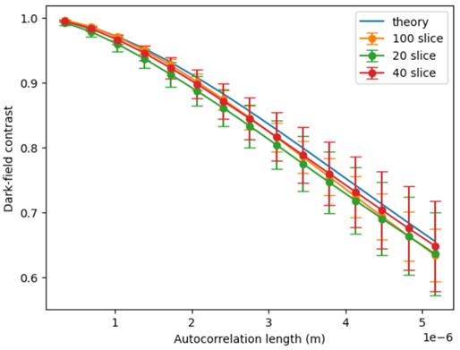

# GI Simulation - Python

Quantitative Dark-Field Signal Simulation for 2D Parallel Beam (Polychromatic Energy Spectrum) Based on X-ray Grating Interferometer (GI).

This project simulates the full imaging pipeline of a Talbot-Lau grating interferometer, including source generation, grating diffraction, Fresnel wave propagation, phantom interaction, phase stepping, and detector response. It supports both 1D and 2D simulation modes with CPU/GPU acceleration.

## Project Structure

```
gi_simulation_mk3-python/
├── main.py                        # Entry point (legacy, calls mod4)
├── GI_SimDemo_phant_mod5.py       # Main simulation engine (latest version)
├── GI_SimDemo_phant_mod4.py       # Previous version of simulation engine
├── configs/                       # Simulation configuration files
│   ├── config_bg.py               #   Background (no phantom) configuration
│   ├── config_sphere.py           #   Sphere phantom configuration
│   └── calc_para.py               #   Standalone parameter calculator
├── functions/                     # Core simulation modules
│   ├── create_grating_v2.py       #   Grating complex transmission function
│   ├── fresnel_propagation_poly_v2.py  #   Polychromatic Fresnel propagation
│   ├── conv_PSF_v2.py             #   Source PSF convolution (G0 projection)
│   ├── projection_approximation_v2.py  #   Projection approximation for phantom
│   ├── multi_slice_propagation_mod3.py #   Multi-slice propagation for phantom
│   ├── single_slice_propagation_mod3.py#   Single-slice propagation
│   ├── phase_stepping.py          #   Phase stepping scan simulation
│   ├── calc_FCA.py                #   Fourier Component Analysis (visibility, phase)
│   ├── detector.py                #   Detector pixelation and response
│   ├── add_poission_noise.py      #   Poisson noise model
│   ├── configure_log.py           #   Logging setup
│   ├── configure_output.py        #   Output file management
│   ├── gpu_memory.py              #   GPU memory monitoring
│   ├── MappingVarName.py          #   Config variable name mapping
│   └── v1/                        #   Archived v1 functions
├── phantom/                       # Phantom generation and data
│   ├── Sphere_3D_v5.py            #   3D sphere packing (parallel, shared memory)
│   ├── SphereFlat.py              #   2D sphere packing (relaxation algorithm)
│   └── *.npz                      #   Pre-generated phantom data
├── spectrums/                     # X-ray spectrum and detector response data
│   ├── 60kVp_spec.mat             #   60 kVp X-ray tube spectrum
│   ├── ER_60.mat                  #   Detector energy response (60 keV range)
│   └── supports/                  #   Scintillator data & MATLAB helpers
├── XOPDATA/                       # X-ray material optical properties (refractive index)
├── results/                       # Simulation output (.npz, .npy, notebooks)
├── figs/                          # Figures
└── logs/                          # Simulation runtime logs
```

## Simulation Pipeline

The simulation follows the physical process of X-ray grating interferometry:

```
Source (G0) --> G1 Grating --> [Phantom] --> Fresnel Propagation --> G2 Grating --> Detector
                                                                     ↓
                                                              Phase Stepping
                                                                     ↓
                                                          Fourier Analysis (FCA)
                                                                     ↓
                                                     Visibility / Amplitude / Phase
```

1. **Initial wavefront**: Generate polychromatic X-ray wavefront weighted by energy spectrum
2. **G1 grating**: Apply complex transmission function (absorption / pi-phase / pi/2-phase grating)
3. **Phantom interaction** (optional): Propagate through sample using either:
   - **Projection approximation**: Phase shift accumulated along beam path (faster)
   - **Multi-slice propagation**: Slice-by-slice Fresnel propagation (more accurate)
4. **Fresnel propagation**: Polychromatic Fresnel diffraction from G1 to G2 plane
5. **Source PSF convolution**: Project G0 grating to G2 plane and convolve (Talbot-Lau system)
6. **Phase stepping**: Scan G2 grating position to generate stepping curve
7. **Detection**: Pixelate intensity, apply detector energy response, optional Poisson noise
8. **Fourier Component Analysis**: Extract visibility, amplitude, and phase from stepping curve

## Configuration

All simulation parameters are defined in Python config files under `configs/`. Two example configurations are provided:

- **`config_bg.py`**: Background simulation (no phantom), used to obtain reference visibility
- **`config_sphere.py`**: Sphere phantom simulation, used to compute dark-field signal

### Key Parameters

| Category | Parameter | Description |
|----------|-----------|-------------|
| **Imaging** | `FOV` | Field of view [m] |
| | `nP` | Number of sampling points |
| | `nSteps` | Phase stepping steps per period |
| **Geometry** | `totalLength` | System total length (G0 to G2) [m] |
| | `magRatio` | Magnification ratio (L+D)/L |
| **Source** | `srcType` | `'planewave'` or `'pointsource'` |
| | `psfFlag` | Enable source PSF convolution (0/1) |
| **Gratings** | `g0/g1/g2Period` | Grating pitch [m] |
| | `g1Type` | `'Absorption'`, `'pi-phase'`, or `'pi/2-phase'` |
| | `g0/g1/g2Material` | Grating material (element symbol) |
| **Detector** | `detType` | `'EnergyIntegral'` or `'PhotonCounting'` |
| | `pixelSize` | Detector pixel size [m] |
| | `noiseFlag` | Enable Poisson noise (0/1) |
| **Phantom** | `phantomFlag` | Enable phantom (0/1) |
| | `propaMode` | `'projection_approxi'` or `'mult_slice'` |
| | `disSG2` | Sample-to-G2 distance [m] |
| **Computation** | `useDevice` | `'CPU'` or `'GPU'` |
| | `propagationDim` | `'1D'` or `'2D'` |

### Dynamic Parameters

The simulation supports parameter sweeping via dynamic parameters. Configure `nDynamicParas`, `dynamicParasNames`, and `dynamicRange1/2/...` to sweep over energy, grating period, distance, etc.

## Usage

### 1. Generate Phantom (if needed)

Generate 3D sphere phantom with tunable volume fraction:

```python
# For high-packing 3D spheres (parallel, shared memory relaxation)
python phantom/Sphere_3D_v5.py

# For 2D flat sphere packing
python phantom/SphereFlat.py
```

The sphere generator uses a force-directed relaxation algorithm to pack spheres to the target volume fraction, then rasterizes them to a voxel grid and slices into layers.

### 2. Configure Parameters

Create or modify a config file in `configs/`:

```python
# configs/config_sphere.py
phantomFlag = 1
propaMode = 'projection_approxi'
phantom = 'Sph_40.0um_0.4_40'
phantomMaterial = 'PMMA'
useDevice = 'GPU'
propagationDim = '2D'
# ... (see existing config files for full parameter list)
```

### 3. Run Simulation

```python
from GI_SimDemo_phant_mod5 import GI_SimDemo_phant_mod4

# Run with a config file name (without .py extension)
GI_SimDemo_phant_mod4('config_sphere')   # Sphere phantom simulation
GI_SimDemo_phant_mod4('config_bg')       # Background reference simulation
```

Or directly:

```bash
python GI_SimDemo_phant_mod5.py
```

### 4. Analyze Results

Results are saved as `.npz` files in the `results/` directory. Jupyter notebooks in `results/` demonstrate how to load and analyze the output data.

## Dependencies

- **Python 3.x**
- **NumPy** - Array operations
- **SciPy** - Interpolation, .mat file I/O
- **CuPy** - GPU-accelerated computation (requires NVIDIA GPU + CUDA)
- **tqdm** - Progress bars (phantom generation)
- **matplotlib** - Visualization (optional)

## Validation

Theoretical dark-field signals for 40 um diameter microspheres (PMMA) with 0.4 volume fraction were compared with simulation results at varying autocorrelation lengths. The simulations with different slice counts (20, 40, 100 slices) show good agreement with the theoretical prediction.



## Development History

- **2021/11**: First version - 1D mode (Chengpeng Wu)
- **2022/07**: Added phantom support - 1D mode (Peiyuan Guo)
- **2022/09**: Added amplitude and phase extraction - 1D mode (Peiyuan Guo)
- **2024/10**: Added 2D mode (Longchao Men)

## Future Improvements

- Integrate [spekpy](https://bitbucket.org/spekpy/spekpy_release/) for X-ray spectrum generation
- Use Python libraries (e.g., xraydb) for loading refractive index data instead of XOPDATA files
- Refactor to object-oriented architecture with Python classes
